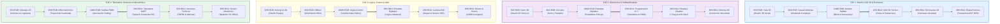

# UNIDAD EDUCATIVA LEV VYGOTSKY
**Syllabus Robótica — Autor: David Castro**  
*Esquema Visual de Secuencialidad Inter-Anual (Relación Vertical entre Cursos: 8vo EGB a 3ro BGU)*

---

```mermaid
flowchart TD
    subgraph EJE1 ["EJE 1: Diseño CAD 3D & Estructura"]
        E1_8["8VO EGB: Taza 3D<br/>(Diseño 3D Inicial)"] --> E1_9["9NO EGB: Casas/Litofanías<br/>(Modelado Complejo)"]
        E1_9 --> E1_10["10MO EGB: Arduino Salidas<br/>(Blink & Secuencias)"]
        E1_10 ==> E1_1B["1RO BGU: CAD 3D Técnico<br/>(Cotas & Tolerancias)"]
        E1_1B --> E1_2B["2DO BGU: Enclosures 3D<br/>(Carcasas Vaciadas)"]
        E1_2B --> E1_3B["3RO BGU: Etapa Potencia<br/>(Transistores BJT NPN)"]
    end

    subgraph EJE2 ["EJE 2: Electrónica & Salidas/Displays"]
        E2_8["8VO EGB: Carro 3D<br/>(Diseño 3D Técnico)"] --> E2_9["9NO EGB: Circuitos<br/>(Serie y Paralelo)"]
        E2_9 --> E2_10["10MO EGB: Entradas Digitales<br/>(Pulsadores Pull-up)"]
        E2_10 ==> E2_1B["1RO BGU: Programación C++<br/>(Semáforos & PWM)"]
        E2_1B --> E2_2B["2DO BGU: Displays Visuales<br/>(7-Seg & LCD 16x2)"]
        E2_2B --> E2_3B["3RO BGU: Motores DC<br/>(Control de Velocidad)"]
    end

    subgraph EJE3 ["EJE 3: Lógica, Control & ADC"]
        E3_8["8VO EGB: Among Us 3D<br/>(Diseño Espejo)"] --> E3_9["9NO EGB: mBlock<br/>(Movimiento mBot)"]
        E3_9 --> E3_10["10MO EGB: Lógica Control<br/>(Condicionales if/else)"]
        E3_10 ==> E3_1B["1RO BGU: Entradas Digitales<br/>(Lógica Industrial)"]
        E3_1B --> E3_2B["2DO BGU: Lectura ADC<br/>(Mapeo & Sensor LDR)"]
        E3_2B --> E3_3B["3RO BGU: Drivers & Servos<br/>(L298N & Angular)"]
    end

    subgraph EJE4 ["EJE 4: Telemetría, Sensores & Mecatrónica"]
        E4_8["8VO EGB: Inkscape 2D<br/>(Vectores & Logotipos)"] --> E4_9["9NO EGB: mBot Autónomo<br/>(Trayectoria Cuadrada)"]
        E4_9 --> E4_10["10MO EGB: Salidas PWM<br/>(Atenuación Fading)"]
        E4_10 ==> E4_1B["1RO BGU: Telemetría UART<br/>(Serial & Comandos PC)"]
        E4_1B --> E4_2B["2DO BGU: Sensores Térmicos<br/>(TMP36 & Alarmas)"]
        E4_2B --> E4_3B["3RO BGU: Sensor Ultrasónico<br/>(Medición HC-SR04)"]
    end

    style EJE1 fill:#e3f2fd,stroke:#1565c0,stroke-width:1.5px
    style EJE2 fill:#f3e5f5,stroke:#7b1fa2,stroke-width:1.5px
    style EJE3 fill:#fffde7,stroke:#fbc02d,stroke-width:1.5px
    style EJE4 fill:#e8f5e9,stroke:#2e7d32,stroke-width:1.5px
```
