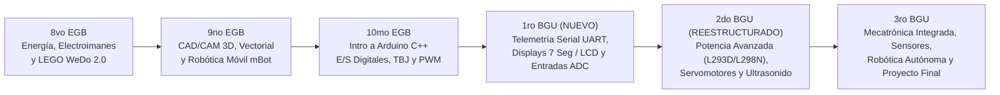

# 🧠 MEMORIA MAESTRA Y REGISTRO DE DECISIONES DEL PROYECTO DE ROBÓTICA

**Institución:** Antigravity Academy / Bachillerato General Unificado y Básica Superior  
**Docente:** Ing. David Rógel N.  
**Fecha de Auditoría y Reestructuración:** Septiembre 2026  
**Repositorio GitHub:** `temario_BACH`  
**Ubicación Raíz:** `C:\Users\David\Desktop\clases bach`

---

## 📌 1. ANTECEDENTES Y RESUMEN DE AUDITORÍA PEDAGÓGICA

Tras auditar la documentación legada del docente saliente (Planes Anuales PCA, Planes de Unidad PUD y archivos de estudiantes de 2024 a 2027), se detectaron dos hallazgos críticos de continuidad:

1. **Solapamiento 10mo EGB vs 1ro BGU:** En la malla original, 10mo EGB y 1ro BGU recibían exactamente la misma materia introductoria de Arduino C++ (*Blink, Semáforo, Auto Fantástico, Botones, Transistores TBJ y PWM*). Los estudiantes que ascendían de 10mo a 1ro BGU repetían los mismos contenidos.
2. **Redundancia en 2do BGU:** Se repetía en el primer parcial el módulo de CAD 3D de 9no EGB (Tinkercad), quitándole tiempo al desarrollo avanzado de electrónica de potencia y robótica móvil.

---

## 💡 2. SOLUCIÓN IMPLEMENTADA Y REESTRUCTURACIÓN DE LA MALLA

Se diseñó una progresión de continuidad de 6 niveles donde **ningún curso repite temas**:

---

## ⚙️ 3. ESTRUCTURA ANUAL Y MODALIDADES DIDÁCTICAS

* **Duración por Clase:** 45 Minutos por sesión.
* **Estructura Anual:** 4 Secciones / Unidades al año | 6 Clases por Sección | **Total: 24 Clases al año por nivel**.
* **Modalidades Registradas:**
  * 💻 **[SIMULACIÓN / PC]:** Desarrollo individual en Tinkercad, Inkscape, mBlock o IDE Arduino.
  * 🛠️ **[PRÁCTICA FÍSICA]:** Trabajo en parejas en protoboard, kits LEGO, mBot o módulos de sensores reales.

---

## 🎒 4. HARWARE Y EQUIPAMIENTO DE LABORATORIO VERIFICADO

Se realizó una auditoría visual del equipamiento físico del laboratorio a través del kit institucional:
* **Kit de Laboratorio Físico:** **Elegoo UNO R3 Ultimate Starter Kit** (100% de coincidencia comprobada).
* **Cobertura:** El kit contiene el 100% de los componentes requeridos para 10mo EGB, 1ro BGU, 2do BGU y 3ro BGU (Arduino UNO, LEDs, Resistencias, Transistores TBJ, Diodos 1N4007, Potenciómetros, Displays 7 Seg, Pantalla LCD 1602, LDR, Sensor de Nivel de Agua, Servomotor SG90, Sensor Ultrasonido HC-SR04, Módulo Relé 5V, Teclado 4x4 y RFID).
* **Gasto adicional:** $0.00 USD (No se requiere comprar material nuevo).

---

## 📂 5. ESTRUCTURA DE ARCHIVOS Y DEPURACIÓN DE DATOS

Para agilizar la búsqueda y optimizar el espacio en disco, se aplicó un mantenimiento profundo en el workspace:

1. **Depuración de Entregables:** Se depuraron más de 1,900 entregables de años anteriores, conservando **únicamente 2 ejemplos representativos por actividad** en cada subcarpeta de curso.
2. **Archivos de Resumen Creados por Curso:**
   * `RESUMEN_RECURSOS_CURSO.txt`: Inventario de PDFs maestras y muestras depuradas.
   * `LISTA_TEMAS_PARA_PCA_Y_PUD.md`: Temario redactado en formato copiar/pegar para documentos oficiales Word/Excel.
   * `GUIA_CAMBIOS_PCA_PUD.md`: Instructivo con prioridades y secciones a modificar en los PCA/PUD oficiales.
3. **Mapeo de Diapositivas PDF:** Cada una de las 24 clases anuales por nivel incluye la referencia explícita del rango de diapositivas a proyectar (ej. `PDF Guía: Diapositivas 4-9`).

---

## 📲 6. HERRAMIENTAS DE SEGUIMIENTO Y DEPLOYMENT

* **Master Data JSON:** `PLANIFICACION_ANUAL_ROBOTICA_REESTRUCTURADA.json` (Consolidado estructurado).
* **Master Document MD:** `PLANIFICACION_ANUAL_ROBOTICA_REESTRUCTURADA.md` (Documento maestro).
* **Web Tracker Móvil:** `index.html` (Aplicación web local y compatible con **GitHub Pages** para consultar la clase del día desde el teléfono celular).

---
*Documento de memoria técnica generado para continuidad pedagógica y referencia permanente.*
