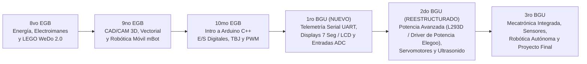

# 🤖 PLANIFICACIÓN MAESTRA Y REESTRUCTURADA DE ROBÓTICA
**Institución:** Antigravity Academy / Bachillerato General Unificado y Básica Superior  
**Docente Entrante:** Ing. David Rógel N.  
**Duración de Clase:** 45 Minutos por sesión  
**Estructura Anual:** 4 Secciones / Unidades al año | 6 Clases por Sección | **Total: 24 Clases al año por nivel**

---

## 📐 1. ANÁLISIS CRÍTICO DE CONTINUIDAD Y SOLUCIÓN PEDAGÓGICA

> 🎒 **EQUIPAMIENTO DE LABORATORIO COMPATIBLE 100%:** 
> Esta planificación ha sido optimizada y verificada para utilizar la totalidad de los componentes del kit físico existente en la institución: **Elegoo UNO R3 Ultimate Starter Kit**. **NO SE REQUIERE COMPRAR MATERIAL ADICIONAL.**


### ⚠️ El Problema Detectado en la Transición
1. **Solapamiento 10mo EGB vs 1ro BGU:** En el periodo anterior, 10mo EGB y 1ro BGU recibieron la misma materia de *Fundamentos de Arduino (Leds, Semáforo, Auto Fantástico, Botones, TBJ, PWM)*. Los alumnos que hoy pasan de 10mo a 1ro BGU repetirían exactamente el mismo contenido.
2. **Redundancia en 2do BGU:** Se repetía el módulo de CAD 3D de 9no EGB en el Quimestre 1, restándole tiempo al desarrollo avanzado de electrónica y programación.

### 💡 Solución y Nueva Progresión de Continuidad



---

## ⏱️ 2. ESTRUCTURA DIDÁCTICA DE LA CLASE DE 45 MINUTOS

Cada sesión de 45 minutos sigue una distribución neurodidáctica estricta para garantizar el cumplimiento de los 3 entregables (Cuaderno Digital, Preparatorio e Informe):

```
┌────────────────────────────────────────────────────────────────────────┐
│  00-05 min │ 🎯 MOTIVACIÓN Y RETROALIMENTACIÓN (Pregunta activadora)   │
│  05-15 min │ 💡 TEORÍA Y MODELADO (MÁXIMO 10 MINUTOS DE TEORÍA)        │
│  15-40 min │ 💻 / 🛠️ PRÁCTICA INTENSIVA (25 MINUTOS DE ACCIÓN PURA)   │
│  40-45 min │ 📝 CIERRE Y VERIFICACIÓN (Revisión de entregable/bitácora)│
└────────────────────────────────────────────────────────────────────────┘
```

* **Modalidad 💻 SIMULACIÓN / PC:** Trabajo individual en Tinkercad, Inkscape, mBlock o IDE Arduino.
* **Modalidad 🛠️ PRÁCTICA FÍSICA:** Trabajo en equipos (2 personas) en protoboard, kits LEGO, mBot o módulos de sensores.

---

## 📅 3. MALLA CURRICULAR ANUAL POR CURSOS (4 SECCIONES × 6 CLASES)

---

### 📘 8VO EGB — CIENCIAS ENERGÉTICAS, ELECTROMAGNETISMO Y LEGO WEDO 2.0

#### 📌 SECCIÓN 1: Ciencias Energéticas y Generación Eléctrica
* **Clase 1 [💻 Simulación Interactiva PhET]: Carga Eléctrica y Formas de Energía** *(PDF Guía: Diapositivas 1-5)*
  * *Subtemas:* Definición de energía, conservación de energía, cargas eléctricas y átomos.
  * *Actividad:* Simulación interactiva de flujo de electrones y cargas en PhET Virtual Lab (DC Construction Kit).
* **Clase 2 [🛠️ Práctica Física]: Generación Electroquímica (Batería Casera de Limón)** *(PDF Guía: Diapositivas 5-9)*
  * *Subtemas:* Reacciones redox, cátodo (+), ánodo (-), voltaje generado y encendido de LED red.
  * *Actividad:* Armado físico de celdas electroquímicas con clavos de zinc y monedas de cobre.
* **Clase 3 [🛠️ Práctica Física]: Generación Mecánica e Inducción Magnética** *(PDF Guía: Diapositivas 9-13)*
  * *Subtemas:* Ley de Faraday, imanes, bobinas y conversión de energía mecánica a eléctrica.
  * *Actividad:* Construcción manual de generador rotativo accionando motor DC.
* **Clase 4 [💻 Simulación / Teoría]: Termoelectricidad y Geotermia** *(PDF Guía: Diapositivas 13-17)*
  * *Subtemas:* Transformación térmica, ciclos de vapor, turbinas y plantas geotérmicas.
  * *Actividad:* Análisis guiado y simulación conceptual de ciclos de potencia.
* **Clase 5 [💻 Simulación / Teoría]: Energía Fotovoltaica y Efecto Fotoeléctrico** *(PDF Guía: Diapositivas 17-21)*
  * *Subtemas:* Celdas solares, fotones, silicio tipo P y N, medición de irradiación.
  * *Actividad:* Ficha técnica e investigación de paneles solares y cálculo de eficiencia.
* **Clase 6 [💻 Simulación / Teoría]: Energía Nuclear y Fisión** *(PDF Guía: Diapositivas 21-25)*
  * *Subtemas:* Núcleo atómico, fisión de Uranio-235, reactores y medidas de seguridad.
  * *Actividad:* Evaluación de Sección 1 y debate sobre la transición energética.

#### 📌 SECCIÓN 2: Electromagnetismo y Circuitos Básicos
* **Clase 7 [💻 Simulación / Teoría]: Magnitudes Eléctricas y Corrientes (DC vs AC)** *(PDF Guía: Diapositivas 25-29)*
  * *Subtemas:* Voltaje, Corriente, Resistencia, frecuencia y diferencias entre DC y AC.
  * *Actividad:* Clasificación y ficha técnica de 7 aparatos de DC y 7 de AC.
* **Clase 8 [🛠️ Práctica Física]: Electromagnetismo y Fuerza de Lorentz** *(PDF Guía: Diapositivas 29-33)*
  * *Subtemas:* Campo magnético, regla de la mano derecha, bobinado de alambre esmaltado.
  * *Actividad:* Construcción de un electroimán y motor homopolar sencillo (pila + imán de neodimio).
* **Clase 9 [💻 Simulación / PC]: Introducción a Circuitos en Tinkercad Circuits** *(PDF Guía: Diapositivas 33-37)*
  * *Subtemas:* Interfaz de Tinkercad, fuente de voltaje, protoboard virtual, interruptores y LEDs.
  * *Actividad:* Simulación de circuito simple con resistencia de protección ($220\Omega$).
* **Clase 10 [🛠️ Práctica Física]: Circuito Eléctrico en Serie** *(PDF Guía: Diapositivas 37-41)*
  * *Subtemas:* Caída de voltaje, corriente constante, comportamiento al desconectar un componente.
  * *Actividad:* Cableado físico de 3 focos en serie alimentados con batería.
* **Clase 11 [🛠️ Práctica Física]: Circuito Eléctrico en Paralelo** *(PDF Guía: Diapositivas 41-45)*
  * *Subtemas:* Voltaje constante, suma de corrientes por ramas, independencia de nodos.
  * *Actividad:* Cableado físico de 3 focos en paralelo y comparación con el circuito en serie.
* **Clase 12 [💻 Simulación / Teoría]: Cierre de Módulo de Electromagnetismo** *(PDF Guía: Diapositivas 45-49)*
  * *Subtemas:* Ley de Ohm ($V=I \cdot R$), resolución de ejercicios básicos de circuitos.
  * *Actividad:* Evaluación práctica y presentación de informe consolidado de laboratorio.

#### 📌 SECCIÓN 3: Introducción a Robótica Mecánica con LEGO WeDo 2.0
* **Clase 13 [🛠️ Práctica Física]: Reconocimiento e Inventario del Kit LEGO WeDo 2.0** *(PDF Guía: Diapositivas 49-53)*
  * *Subtemas:* Smarthub, motor mediano, sensor de distancia, sensor de inclinación, engranajes y vigas.
  * *Actividad:* Clasificación de piezas y elaboración de la bitácora de inventario (IR4).
* **Clase 14 [💻 Simulación / PC]: Software LEGO WeDo 2.0 y Primeros Bloques** *(PDF Guía: Diapositivas 53-57)*
  * *Subtemas:* Entorno gráfico por bloques, bloque de inicio, control de potencia y sentido de giro.
  * *Actividad:* Primer programa de prueba para encendido de luz de Smarthub y sonidos.
* **Clase 15 [🛠️ Práctica Física]: Proyecto LEGO 1 — Ventilador de Velocidad Variable** *(PDF Guía: Diapositivas 57-61)*
  * *Subtemas:* Reducción/multiplicación de velocidad con engranajes, bucles infinitos (*Loops*).
  * *Actividad:* Ensamble mecánico del ventilador y programación de control por botón en pantalla.
* **Clase 16 [🛠️ Práctica Física]: Proyecto LEGO 2 — Satélite y Mecánica de Rotación** *(PDF Guía: Diapositivas 61-65)*
  * *Subtemas:* Ejes de transmisión, inercia, fuerza centrípeta y estabilidad de estructuras.
  * *Actividad:* Ensamble del modelo Satélite e implementación de temporizadores de giro.
* **Clase 17 [🛠️ Práctica Física]: Proyecto LEGO 3 — Robot Espía (Sensor de Distancia Infrarrojo)** *(PDF Guía: Diapositivas 65-69)*
  * *Subtemas:* Sensores de proximidad, condicionales de entrada, disparo de alarmas sonoras.
  * *Actividad:* Construcción del Robot Espía que detecta intrusos a menos de $15\text{ cm}$.
* **Clase 18 [🛠️ Práctica Física]: Proyecto LEGO 4 — Robot Milo Explorador (Parte A: Chasis y Tracción)** *(PDF Guía: Diapositivas 69-73)*
  * *Subtemas:* Robótica móvil, tren de rodaje, tracción simple y centro de gravedad.
  * *Actividad:* Ensamble del chasis base de Milo y pruebas de desplazamiento rectilíneo.

#### 📌 SECCIÓN 4: Robótica Móvil LEGO Avanzada y Desafíos
* **Clase 19 [🛠️ Práctica Física]: Proyecto LEGO 4 — Robot Milo Explorador (Parte B: Brazo Sensor)** *(PDF Guía: Diapositivas 73-77)*
  * *Subtemas:* Integración de sensor de inclinación y brazo manipulador articulado.
  * *Actividad:* Programación de Milo para detenerse al detectar un obstáculo en el suelo.
* **Clase 20 [🛠️ Práctica Física]: Proyecto LEGO 5 — Sapo Metamórfico (Mecanismo de Palancas)** *(PDF Guía: Diapositivas 77-81)*
  * *Subtemas:* Transformación de movimiento rotatorio a lineal articulado (biela-manivela).
  * *Actividad:* Ensamble de piernas articuladas y programación de saltos periódicos.
* **Clase 21 [🛠️ Práctica Física]: Proyecto LEGO 6 — Camión de Rescate (Mecanismo de Oruga)** *(PDF Guía: Diapositivas 81-85)*
  * *Subtemas:* Mecánica de tracción pesada, torque vs velocidad, transporte de carga.
  * *Actividad:* Construcción de camión articulado para arrastre de objetos.
* **Clase 22 [💻 Simulación / PC]: Algoritmos Complejos en LEGO (Condicionales Anidados)** *(PDF Guía: Diapositivas 85-89)*
  * *Subtemas:* Múltiples condiciones, toma de decisiones combinada (Distancia + Inclinación).
  * *Actividad:* Programación en pantalla de rutinas de rescate ante emergencias.
* **Clase 23 [🛠️ Práctica Física]: Reto Robótico LEGO — Carrera de Obstáculos y Automatización** *(PDF Guía: Diapositivas 89-93)*
  * *Subtemas:* Optimización de código, tiempos de respuesta y precisión de sensores.
  * *Actividad:* Competencia en pista: los robots deben navegar autónomamente sorteando marcas.
* **Clase 24 [💻 Simulación / Teoría]: Evaluación Final y Presentación de Bitácora Anual** *(PDF Guía: Diapositivas 93-97)*
  * *Subtemas:* Revisión de portafolios, conclusiones del año y desmontaje/inventario final.
  * *Actividad:* Entrega de bitácora final y rúbrica de desempeño.

---

### 📗 9NO EGB — FABRICACIÓN DIGITAL (CAD 3D/2D) Y ROBÓTICA MÓVIL MBOT

#### 📌 SECCIÓN 1: Diseños CAD 3D en Tinkercad (Modelado Fundamental)
* **Clase 1 [💻 Simulación / PC]: Introducción a Tinkercad y Manipulación de Volúmenes** *(PDF Guía: Diapositivas 1-5)*
  * *Subtemas:* Ejes cartesiano $X, Y, Z$, vista 3D, plano de trabajo, alineación y reagrupamiento.
  * *Actividad:* Ejercicio de figuras simples y creación del primer volumen hueco.
* **Clase 2 [💻 Simulación / PC]: Diseño CAD 1 — Taza de Chocolate con Asa** *(PDF Guía: Diapositivas 5-9)*
  * *Subtemas:* Cilindro hueco, vaciado interno, geometría del asa (toroide) y biselado de bordes.
  * *Actividad:* Modelado tridimensional completo de una taza de chocolate.
* **Clase 3 [💻 Simulación / PC]: Diseño CAD 2 — Vehículo Mecánico (Chasis y Ruedas)** *(PDF Guía: Diapositivas 9-13)*
  * *Subtemas:* Agrupación de piezas complejas, colocación de ejes, ruedas y carrocería aerodinámica.
  * *Actividad:* Modelado de carro en 3D respetando medidas y tolerancias reales.
* **Clase 4 [💻 Simulación / PC]: Diseño CAD 3 — Personaje con Simetría Axial (Mirror)** *(PDF Guía: Diapositivas 13-17)*
  * *Subtemas:* Herramienta *Mirror* (Espejo), duplicación en matriz y escala proporcional.
  * *Actividad:* Modelado 3D de personaje *Among Us* utilizando formas redondeadas y visores.
* **Clase 5 [💻 Simulación / PC]: Proyecto Integrador CAD — Casa de Caricatura (Parte 1)** *(PDF Guía: Diapositivas 17-21)*
  * *Subtemas:* Estructuras arquitectónicas, muros, techo inclinado, huecos de puertas y ventanas.
  * *Actividad:* Diseño de la estructura principal y fachadas de la casa 3D.
* **Clase 6 [💻 Simulación / PC]: Proyecto Integrador CAD — Casa de Caricatura (Parte 2)** *(PDF Guía: Diapositivas 21-25)*
  * *Subtemas:* Texturizado de superficies, detalles interiores, tejas y renderizado de vista.
  * *Actividad:* Finalización del modelo 3D e informe de diseño (IR1).

#### 📌 SECCIÓN 2: Vectorización 2D (Inkscape) e Impresión 3D Aditiva (Litofanías)
* **Clase 7 [💻 Simulación / PC]: Introducción a Inkscape y Trazo Vectorial** *(PDF Guía: Diapositivas 25-29)*
  * *Subtemas:* Gráficos raster vs vectoriales, nodos, curvas Bézier y formatos `.PNG` vs `.SVG`.
  * *Actividad:* Creación de trazos vectoriales geométricos en Inkscape.
* **Clase 8 [💻 Simulación / PC]: Vectorización de Logotipos (PNG a SVG)** *(PDF Guía: Diapositivas 29-33)*
  * *Subtemas:* Herramienta *Vectorizar mapa de bits*, umbrales de brillo y simplificación de nodos.
  * *Actividad:* Conversión de imagen rasterizada `.PNG` a vector `.SVG` limpio.
* **Clase 9 [💻 Simulación / PC]: Importación 2D-to-3D — Llavero Personalizado en Tinkercad** *(PDF Guía: Diapositivas 33-37)*
  * *Subtemas:* Extrusión de archivos `.SVG` en Tinkercad, altura de capa y perforación para argolla.
  * *Actividad:* Generación del modelo 3D de un llavero personalizado listo para imprimir.
* **Clase 10 [💻 Simulación / PC]: Fundamentos de Fabricación Aditiva y Laminado (Slicing)** *(PDF Guía: Diapositivas 37-41)*
  * *Subtemas:* Impresoras FDM, filamentos (PLA, ABS), temperatura de boquilla, infilled ($15\text{-}20\%$) y soportes.
  * *Actividad:* Configuración en Ultimaker Cura para generar el archivo `.gcode`.
* **Clase 11 [💻 Simulación / PC]: Proyecto Litofanías 3D (Fotografía en Relieve)** *(PDF Guía: Diapositivas 41-45)*
  * *Subtemas:* Litofanía, variación de grosor para traslucidez de luz, mapas de altura en escala de grises.
  * *Actividad:* Conversión de foto personal a modelo 3D de litofanía (IR2).
* **Clase 12 [🛠️ Práctica Física]: Demostración de Impresión 3D en Vivo y Calibración** *(PDF Guía: Diapositivas 45-49)*
  * *Subtemas:* Calibración de cama caliente (*Leveling*), purga de extrusor y adherencia (*Brim/Raft*).
  * *Actividad:* Impresión en tiempo real de los llaveros vectorizados por los estudiantes.

#### 📌 SECCIÓN 3: Electrónica de Potencia Básica y Robótica mBot
* **Clase 13 [💻 Simulación / PC]: Simulación de Circuitos de Potencia en Tinkercad** *(PDF Guía: Diapositivas 49-53)*
  * *Subtemas:* Motores DC, interruptores, baterías de 9V y regulación de corriente con resistencias.
  * *Actividad:* Simulación de control manual de sentido de giro de un motor DC.
* **Clase 14 [🛠️ Práctica Física]: Montaje Físico de Circuito Motor DC** *(PDF Guía: Diapositivas 53-57)*
  * *Subtemas:* Conexión de portapilas, interruptor basculante, motor DC y verificación de consumo.
  * *Actividad:* Armado físico del circuito en protoboard e informe técnico.
* **Clase 15 [🛠️ Práctica Física]: Reconocimiento del Robot Móvil mBot y Placa mCore** *(PDF Guía: Diapositivas 57-61)*
  * *Subtemas:* Microcontrolador ATmega328P, puentes H integrados, puertos RJ25, LEDs RGB y Buzzer.
  * *Actividad:* Inventario, inspección de cableado y verificación de encendido de mBot.
* **Clase 16 [💻 Simulación / PC]: Software mBlock 5 — Entorno Bloques a C++** *(PDF Guía: Diapositivas 61-65)*
  * *Subtemas:* Cargar código vs modo en vivo (*Live*), eventos de inicio, bloques de movimiento.
  * *Actividad:* Programa 1: Encendido de LEDs RGB integrados y generación de tonos melódicos.
* **Clase 17 [💻 Simulación / PC]: Control Cinemático de Motores DC en mBot** *(PDF Guía: Diapositivas 65-69)*
  * *Subtemas:* Velocidad ($0\text{-}255$), sentido de giro (Avanzar, Retroceder, Virar), tiempo de ejecución.
  * *Actividad:* Programación de maniobras básicas de aceleración y frenado.
* **Clase 18 [🛠️ Práctica Física]: Algoritmo de Trayectoria Geométrica (El Cuadrado Perfecto)** *(PDF Guía: Diapositivas 69-73)*
  * *Subtemas:* Calibración de tiempo de giro a $90^\circ$, inercia de ruedas y fricción con el suelo.
  * *Actividad:* Reto mBot: Realizar un recorrido en cuadrado de $50\text{ cm} \times 50\text{ cm}$ exacto.

#### 📌 SECCIÓN 4: Sensores y Robótica Autónoma con mBot
* **Clase 19 [💻 Simulación / PC]: Sensor Infrarrojo Sigue-Líneas (Principios)** *(PDF Guía: Diapositivas 73-77)*
  * *Subtemas:* Emisor IR y fototransistor, reflexión en blanco ($>$) vs negro ($<$), lecturas digitales (0 y 1).
  * *Actividad:* Algoritmo lógico en mBlock para detección de contraste de pista.
* **Clase 20 [🛠️ Práctica Física]: Autómata Sigue-Líneas en Pista Real** *(PDF Guía: Diapositivas 77-81)*
  * *Subtemas:* Bucle de control binario (*Si ve negro gira a la derecha, si no a la izquierda*).
  * *Actividad:* Práctica de seguimiento de pista de cinta aislante negra sin salir del circuito.
* **Clase 21 [💻 Simulación / PC]: Sensor de Distancia Ultrasonido (Echo y Trigger)** *(PDF Guía: Diapositivas 81-85)*
  * *Subtemas:* Onda ultrasónica ($40\text{kHz}$), tiempo de vuelo, cálculo de distancia en cm.
  * *Actividad:* Programación de umbrales de alerta (si distancia $< 20\text{ cm}$ detenerse).
* **Clase 22 [🛠️ Práctica Física]: Robot Esquiva-Obstáculos Autónomo** *(PDF Guía: Diapositivas 85-89)*
  * *Subtemas:* Lógica de evasión: Avanzar $\rightarrow$ Detectar obstáculo $\rightarrow$ Retroceder $\rightarrow$ Girar a rumbo libre.
  * *Actividad:* Práctica física en laberinto: el mBot navega en habitación llena de cajas sin chocar.
* **Clase 23 [🛠️ Práctica Física]: Integración Multi-Sensor (Sigue-Líneas + Evitador)** *(PDF Guía: Diapositivas 89-93)*
  * *Subtemas:* Variables globales, banderas lógicas y jerarquía de prioridades de sensores.
  * *Actividad:* El robot sigue la línea pero se detiene si un objeto se atraviesa en su carril.
* **Clase 24 [💻 Simulación / Teoría]: Evaluación Final de Robótica Móvil y Entrega de Cuaderno mBot** *(PDF Guía: Diapositivas 93-97)*
  * *Subtemas:* Demostración de proyectos mBot, rúbrica de desempeño y mantenimiento de equipos.
  * *Actividad:* Entrega del Cuaderno Final mBot (A17) y evaluación de cierre.

---

### 📘 10MO EGB — FUNDAMENTOS DE ARDUINO C++, E/S DIGITALES Y POTENCIA BÁSICA

#### 📌 SECCIÓN 1: Sintaxis C++ en Arduino y Salidas Digitales
* **Clase 1 [💻 Simulación / PC]: Estructura de un Sketch de Arduino y Sintaxis C++** *(PDF Guía: Diapositivas 1-5)*
  * *Subtemas:* Microcontrolador ATmega328P, funciones `void setup()` y `void loop()`, punto y coma `;`.
  * *Actividad:* Configuración del entorno Tinkercad Circuits / IDE Arduino.
* **Clase 2 [💻 Simulación / PC]: Simulación del Primer Código — Parpadeo de LED (Blink)** *(PDF Guía: Diapositivas 5-9)*
  * *Subtemas:* `pinMode(pin, OUTPUT)`, `digitalWrite(pin, HIGH/LOW)`, `delay(ms)`.
  * *Actividad:* Simulación de parpadeo de LED con intervalo de $1000\text{ ms}$ y $200\text{ ms}$.
* **Clase 3 [🛠️ Práctica Física]: Montaje Físico del Circuito Blink en Protoboard** *(PDF Guía: Diapositivas 9-13)*
  * *Subtemas:* Identificación de Ánodo (+), Cátodo (-), resistencia de limitación de corriente ($220\Omega$) y líneas de alimentación.
  * *Actividad:* Carga de código desde la laptop al Arduino UNO físico (IR1).
* **Clase 4 [💻 Simulación / PC]: Control de Múltiples Salidas Digitales (Semáforo Vehicular)** *(PDF Guía: Diapositivas 13-17)*
  * *Subtemas:* Declaración de variables enteras (`int ledRojo = 13;`), secuenciamiento temporal.
  * *Actividad:* Simulación de semáforo con tiempos reales (Rojo 5s, Verde 5s, Amarillo 2s).
* **Clase 5 [🛠️ Práctica Física]: Montaje Físico del Semáforo Vehicular y Peatonal** *(PDF Guía: Diapositivas 17-21)*
  * *Subtemas:* Cableado ordenado de 5 LEDs en protoboard, bus común de Tierra (GND).
  * *Actividad:* Armado físico del semáforo con leds de $5\text{ mm}$ (Práctica A5).
* **Clase 6 [💻 Simulación / PC]: Optimización de Código con Bucles `for` (Auto Fantástico)** *(PDF Guía: Diapositivas 21-25)*
  * *Subtemas:* Estructuras repetitivas `for(int i=2; i<=7; i++)`, incremento y arreglos sencillos.
  * *Actividad:* Simulación de secuencia dinámica de barrido de 6 LEDs (Auto Fantástico / Knight Rider).

#### 📌 SECCIÓN 2: Arreglos de Pines y Lógica Condicional
* **Clase 7 [🛠️ Práctica Física]: Montaje Físico del Auto Fantástico (Arreglo de 6 LEDs)** *(PDF Guía: Diapositivas 25-29)*
  * *Subtemas:* Manejo de arneses de cables, código optimizado sin redundancia de líneas.
  * *Actividad:* Armado y carga física de la secuencia de 6 LEDs (A6).
* **Clase 8 [💻 Simulación / PC]: Sistemas de Numeración y Código Binario (Exclusivo 10mo/1ro)** *(PDF Guía: Diapositivas 29-33)*
  * *Subtemas:* Sistema Binario (bits/bytes), Decimal, Hexadecimal y conversión a estados ON/OFF.
  * *Actividad:* Ejercicios de conversión numérica y lección de código binario (A7).
* **Clase 9 [💻 Simulación / PC]: Fundamentos de Lógica Condicional (`if` / `else`)** *(PDF Guía: Diapositivas 33-37)*
  * *Subtemas:* Operadores relacionales (`==`, `>`, `<`, `!=`), evaluación de condiciones verdaderas/falsas.
  * *Actividad:* Simulación de un contador lógico que enciende LEDs según una condición numérica.
* **Clase 10 [🛠️ Práctica Física]: Circuitos LED Serie y Paralelo Controlados por Arduino** *(PDF Guía: Diapositivas 37-41)*
  * *Subtemas:* Ley de Kirchhoff de voltajes y corrientes aplicadas a puertos I/O de microcontrolador ($MAX\ 40\text{mA}$ por pin).
  * *Actividad:* Medición con multímetro del voltaje de salida en pines digitales (A8).
* **Clase 11 [💻 Simulación / PC]: Simulación de Entradas Digitales (Pulsadores)** *(PDF Guía: Diapositivas 41-45)*
  * *Subtemas:* `pinMode(pin, INPUT)`, `digitalRead(pin)`, estado flotante (*Floating pin*).
  * *Actividad:* Simulación de lectura de un pulsador indicando estado HIGH/LOW en monitor.
* **Clase 12 [💻 Simulación / Teoría]: Evaluación de Sección 2 y Preparatorio de Botones** *(PDF Guía: Diapositivas 45-49)*
  * *Subtemas:* Revisión de sintaxis, diagramas esquemáticos y resolución de dudas de condicionales.
  * *Actividad:* Entrega del Preparatorio N°1 y N°2.

#### 📌 SECCIÓN 3: Entradas Digitales, Resistencia Pull-Down/Pull-Up y Control
* **Clase 13 [🛠️ Práctica Física]: Configuración de Resistencia Pull-Down Físico** *(PDF Guía: Diapositivas 49-53)*
  * *Subtemas:* Resistencia de $10\text{k}\Omega$ a GND, estabilización de nivel lógico 0V por defecto.
  * *Actividad:* Cableado físico de botón con Pull-Down y control de un LED (Informe 2).
* **Clase 14 [🛠️ Práctica Física]: Configuración de Resistencia Pull-Up Interna (`INPUT_PULLUP`)** *(PDF Guía: Diapositivas 53-57)*
  * *Subtemas:* Activar resistencia Pull-Up interna de $20\text{k}\Omega$ de Arduino, lógica invertida (0 = Presionado).
  * *Actividad:* Modificación del código para usar `pinMode(pin, INPUT_PULLUP)` eliminando resistencia externa.
* **Clase 15 [💻 Simulación / PC]: Control de Encendido/Apagado por Alternancia (Toggle Switch)** *(PDF Guía: Diapositivas 57-61)*
  * *Subtemas:* Memoria de estado previo, prevención de rebotes (*Debounce* por software con `delay(50)`).
  * *Actividad:* Simulación de botón que enciende con un clic y apaga con el siguiente clic.
* **Clase 16 [🛠️ Práctica Física]: Selector de Modos de Luces mediante 2 Botones** *(PDF Guía: Diapositivas 61-65)*
  * *Subtemas:* Botón 1 selecciones secuencia A, Botón 2 selecciona secuencia B, condicionales `else if`.
  * *Actividad:* Armado físico del selector de 4 efectos luminosos con 2 botones de entrada.
* **Clase 17 [💻 Simulación / PC]: Transistores de Conmutación Bipolar (TBJ / BJT NPN)** *(PDF Guía: Diapositivas 65-69)*
  * *Subtemas:* Transistor 2N2222 / TIP120, regiones de operación (Corte y Saturación), corriente de base ($I_b$).
  * *Actividad:* Simulación de transistor NPN conmutando una carga de mayor corriente (Motor DC 9V).
* **Clase 18 [🛠️ Práctica Física]: Montaje Físico de Conmutación con Transistor TBJ** *(PDF Guía: Diapositivas 69-73)*
  * *Subtemas:* Pin de base con resistencia de $1\text{k}\Omega$, Colector a carga, Emisor a GND común.
  * *Actividad:* Conexión de transistor NPN para encender una tira LED / Motor sin quemar el Arduino (Prep 3).

#### 📌 SECCIÓN 4: Modulación PWM y Proyectos Integradores
* **Clase 19 [💻 Simulación / PC]: Modulación por Ancho de Pulso (PWM)** *(PDF Guía: Diapositivas 73-77)*
  * *Subtemas:* Pines PWM con tilde `~` (3, 5, 6, 9, 10, 11), frecuencia $490\text{Hz}$, ciclo de trabajo (*Duty Cycle* $0\text{-}100\%$).
  * *Actividad:* `analogWrite(pin, valor)` con valor de 0 a 255 para variación de brillo de LED.
* **Clase 20 [🛠️ Práctica Física]: Montaje Físico de Efecto Atenuador (Fade LED con PWM)** *(PDF Guía: Diapositivas 77-81)*
  * *Subtemas:* Variación gradual del Duty Cycle utilizando bucles `for` ascendentes y descendentes.
  * *Actividad:* Carga física del código Fade en 3 LEDs PWM de forma simultánea.
* **Clase 21 [💻 Simulación / PC]: Control de Velocidad de Motores DC mediante PWM** *(PDF Guía: Diapositivas 81-85)*
  * *Subtemas:* Transistor TBJ + Salida PWM de Arduino, protección con Diodo Flyback 1N4007 (F.E.M. inductiva).
  * *Actividad:* Simulación de regulación de RPM de motor de 0 a 100% (Prep 4).
* **Clase 22 [🛠️ Práctica Física]: Montaje de Control de Potencia con Diodo Flyback** *(PDF Guía: Diapositivas 85-89)*
  * *Subtemas:* Colocación correcta en antiparalelo del diodo 1N4007 para absorción de picos de voltaje.
  * *Actividad:* Práctica física de control de motor DC con PWM y transistor TBJ.
* **Clase 23 [💻 Simulación / PC]: Integración del Proyecto Final Parcial (Simulación)** *(PDF Guía: Diapositivas 89-93)*
  * *Subtemas:* Combinación de Botón de encendido + Transistor + PWM Fade + Indicador LED.
  * *Actividad:* Simulación completa en Tinkercad del sistema de automatización de potencia.
* **Clase 24 [🛠️ Práctica Física]: Sustentación del Proyecto Final e Informe consolidado** *(PDF Guía: Diapositivas 93-97)*
  * *Subtemas:* Demostración de funcionamiento físico, pruebas de voltaje con multímetro y revisión de informe.
  * *Actividad:* Entrega del Cuaderno Digital Parcial 2 y evaluación práctica del curso.

---

### 📘 1RO BGU — TELEMETRÍA SERIAL UART, DISPLAYS Y ENTRADAS ANALÓGICAS ADC (NIVEL INTERMEDIO)

> **💡 NOTA DE CONTINUIDAD:** Los alumnos de 1ro BGU ya aprobaron el núcleo de *Blink, Semáforo, Botones y TBJ* en 10mo. Este plan inicia directamente en **Telemetría Serial**, **Displays** y **Conversión ADC**.

#### 📌 SECCIÓN 1: Comunicación Serial UART (Arduino $\leftrightarrow$ Computadora)
* **Clase 1 [💻 Simulación / PC]: Protocolo Asíncrono Serial UART y Baud Rate** *(PDF Guía: Diapositivas 1-5)*
  * *Subtemas:* Transmisión (TX pin 1) y Recepción (RX pin 0), baudios ($9600\text{ bps}$), `Serial.begin(9600)`.
  * *Actividad:* Configuración del Monitor Serial en Tinkercad para imprimir variables y mensajes de texto.
* **Clase 2 [💻 Simulación / PC]: Envío de Datos a la PC (`Serial.print` vs `Serial.println`)** *(PDF Guía: Diapositivas 5-9)*
  * *Subtemas:* Formateo de texto, caracteres de escape `\n`, `\t`, concatenación de cadenas de texto y enteros.
  * *Actividad:* Creación de un contador de segundos impreso en tiempo real por la consola serial.
* **Clase 3 [🛠️ Práctica Física]: Práctica Física de Telemetría Serial desde Arduino Físico** *(PDF Guía: Diapositivas 9-13)*
  * *Subtemas:* Cable USB-B como puente de comunicación UART, selección del Puerto COM correcto en el IDE.
  * *Actividad:* Carga de script de monitoreo de variables a la laptop (Informe Serial A14).
* **Clase 4 [💻 Simulación / PC]: Recepción de Comandos desde la PC (`Serial.available` y `Serial.read`)** *(PDF Guía: Diapositivas 13-17)*
  * *Subtemas:* Buffer de recepción serial, lectura de caracteres ASCII ('1', '0', 'A', 'B'), verificación de disponibilidad.
  * *Actividad:* Simulación de encendido/apagado de 3 LEDs enviando letras desde el teclado de la PC.
* **Clase 5 [🛠️ Práctica Física]: Control Teleoperado de Potencia por Consola Serial** *(PDF Guía: Diapositivas 17-21)*
  * *Subtemas:* Envío de valores numéricos de 0 a 255 para control PWM de motor enviando valores por consola.
  * *Actividad:* Montaje físico de control de velocidad de ventilador mediante tipeo de comandos en la laptop.
* **Clase 6 [💻 Simulación / PC]: Sistema de Seguridad por Contraseña en Consola Serial** *(PDF Guía: Diapositivas 21-25)*
  * *Subtemas:* Comparación de cadenas (`String pass = Serial.readString()`), acceso concedido/denegado.
  * *Actividad:* Programación de cerradura lógica que activa un relé/LED solo con la clave correcta.

#### 📌 SECCIÓN 2: Displays Digitales (7 Segmentos y LCD 16x2)
* **Clase 7 [💻 Simulación / PC]: Display de 7 Segmentos (Ánodo Común vs Cátodo Común)** *(PDF Guía: Diapositivas 25-29)*
  * *Subtemas:* Pinout de los segmentos ($a, b, c, d, e, f, g$), resistores limitadores por segmento.
  * *Actividad:* Simulación del encendido de los dígitos 0 al 9 en un display de 7 segmentos cátodo común.
* **Clase 8 [🛠️ Práctica Física]: Montaje Físico de Contador de 0 a 9 en 7 Segmentos** *(PDF Guía: Diapositivas 29-33)*
  * *Subtemas:* Cableado de 7 pines digitales de Arduino al display, tabla de verdad de segmentos.
  * *Actividad:* Armado físico y programación del contador automático de 1 segundo por número.
* **Clase 9 [💻 Simulación / PC]: Pantalla Cristal Líquido LCD 16x2 (Modo Parallel 4-bits)** *(PDF Guía: Diapositivas 33-37)*
  * *Subtemas:* Pines de LCD (VSS, VDD, V0 contraste, RS, EN, D4-D7), librería `<LiquidCrystal.h>`.
  * *Actividad:* Simulación de inicialización de LCD e impresión de "Hola Mundo" en la fila 0 y 1.
* **Clase 10 [🛠️ Práctica Física]: Montaje de Pantalla LCD 16x2 con Potenciómetro de Contraste** *(PDF Guía: Diapositivas 37-41)*
  * *Subtemas:* Cableado de bus de datos de 4 bits, ajuste del potenciómetro de $10\text{k}\Omega$ para visibilidad de píxeles.
  * *Actividad:* Práctica física de despliegue de mensajes dinámicos con marcas de tiempo.
* **Clase 11 [💻 Simulación / PC]: Funciones Avanzadas de LCD (`lcd.setCursor`, `lcd.scrollDisplay`)** *(PDF Guía: Diapositivas 41-45)*
  * *Subtemas:* Posicionamiento de cursor $(columna, fila)$, borrado selectivo `lcd.clear()`, efecto marquesina.
  * *Actividad:* Programación de un cartel publicitario desplazable de izquierda a derecha.
* **Clase 12 [🛠️ Práctica Física]: Integración: Teclado Serial + Pantalla LCD 16x2** *(PDF Guía: Diapositivas 45-49)*
  * *Subtemas:* Escribir mensajes en el teclado de la PC y visualizarlos instantáneamente en la pantalla LCD.
  * *Actividad:* Proyecto integrador de la Sección 2 con rúbrica de evaluación.

#### 📌 SECCIÓN 3: Entradas Analógicas y Conversor ADC de 10 Bits
* **Clase 13 [💻 Simulación / PC]: Convertidor Analógico-Digital (ADC) de 10-bits** *(PDF Guía: Diapositivas 49-53)*
  * *Subtemas:* Pines analógicos A0-A5, rango de voltaje $0\text{-}5\text{V}$, resolución de $1024$ niveles ($0\text{-}1023$), `analogRead(pin)`.
  * *Actividad:* Simulación de lectura de un potenciómetro y despliegue del valor crudo en el Monitor Serial.
* **Clase 14 [🛠️ Práctica Física]: Montaje Físico y Medición de Divisor de Voltaje con Potenciómetro** *(PDF Guía: Diapositivas 53-57)*
  * *Subtemas:* Resistencia variable de 3 terminales, verificación de voltaje proporcional con multímetro en VDC.
  * *Actividad:* Práctica de lectura analógica con potenciómetro de $10\text{k}\Omega$.
* **Clase 15 [💻 Simulación / PC]: Re-escalado de Rangos con la Función `map()`** *(PDF Guía: Diapositivas 57-61)*
  * *Subtemas:* Sintaxis `map(valor, in_min, in_max, out_min, out_max)`, mapeo de ADC ($0\text{-}1023$) a PWM ($0\text{-}255$).
  * *Actividad:* Simulación de perilla de volumen: potenciómetro regulando intensidad de LED PWM.
* **Clase 16 [🛠️ Práctica Física]: Sensor de Luz LDR (Fotoresistencia) y Divisor de Voltaje** *(PDF Guía: Diapositivas 61-65)*
  * *Subtemas:* Fotoresistencia LDR, comportamiento resistivo ante la luz, fórmula del divisor con $10\text{k}\Omega$ fija.
  * *Actividad:* Armado físico del circuito sensor de luz ambiental e impresión de lecturas en LCD.
* **Clase 17 [💻 Simulación / PC]: Luz Automática Nocturna (Interruptor Crepuscular)** *(PDF Guía: Diapositivas 65-69)*
  * *Subtemas:* Histeresis básica, umbral de disparo por software (`if (luz < 300)` encender relé/LED).
  * *Actividad:* Simulación de poste de alumbrado público que se enciende solo al oscurecer.
* **Clase 18 [🛠️ Práctica Física]: Montaje Físico de Lámpara Crepuscular Automatizada** *(PDF Guía: Diapositivas 69-73)*
  * *Subtemas:* Sensor LDR + Potenciómetro para ajuste fino de sensibilidad de encendido.
  * *Actividad:* Práctica física en protoboard con informe técnico de umbrales.

#### 📌 SECCIÓN 4: Sensores Analógicos de Temperatura y Proyectos de Automatización
* **Clase 19 [💻 Simulación / PC]: Sensor de Temperatura Analógico (TMP36 / LM35)** *(PDF Guía: Diapositivas 73-77)*
  * *Subtemas:* Factor de escala $10\text{mV}/^\circ\text{C}$, conversión de lectura ADC a milivoltios y a grados Celsius.
  * *Actividad:* Simulación de termómetro digital calculando $Temp = (Voltaje - 0.5) \cdot 100$.
* **Clase 20 [🛠️ Práctica Física]: Montaje Físico de Termómetro con Display LCD 16x2** *(PDF Guía: Diapositivas 77-81)*
  * *Subtemas:* Estabilización de lecturas analógicas, filtrado de ruido mediante promedio de 10 lecturas.
  * *Actividad:* Construcción física de estación de temperatura mostrando "$Temp: XX.X ^\circ C$" en LCD.
* **Clase 21 [💻 Simulación / PC]: Climatizador Automático (Control On/Off por Umbral de Temp)** *(PDF Guía: Diapositivas 81-85)*
  * *Subtemas:* Si $Temp > 30^\circ\text{C}$ encender ventilador PWM, si $Temp < 20^\circ\text{C}$ encender calefactor LED.
  * *Actividad:* Simulación de sistema domótico de climatización con alertas visuales.
* **Clase 22 [🛠️ Práctica Física]: Montaje de Sistema Domótico de Alerta por Sobretemperatura** *(PDF Guía: Diapositivas 85-89)*
  * *Subtemas:* Alarma sonora con Buzzer piezoeléctrico (`tone(pin, frecuencia)`), intermitencia de alerta.
  * *Actividad:* Práctica de laboratorio física con sensor de temperatura, buzzer y LED de emergencia.
* **Clase 23 [💻 Simulación / PC]: Integración del Proyecto de Telemetría e Instrumentación** *(PDF Guía: Diapositivas 89-93)*
  * *Subtemas:* Consolidación de lecturas LDR, Temperatura y estado de salidas enviadas por UART e impresas en LCD.
  * *Actividad:* Simulación final del panel de control de procesos industriales.
* **Clase 24 [🛠️ Práctica Física]: Evaluación Final y Defensa del Sistema de Medición** *(PDF Guía: Diapositivas 93-97)*
  * *Subtemas:* Demostración individual de calibración de sensores y defensa oral del código.
  * *Actividad:* Entrega de informes quimestrales e inventario del material de 1ro BGU.

---

### 📕 2DO BGU — DISEÑO 3D TÉCNICO, ELECTRÓNICA DE POTENCIA, DRIVERS Y SERVOMOTORES

#### 📌 SECCIÓN 1: Diagnóstico y Diseño 3D Técnico Avanzado / SimLab (6 Clases - Parcial 1)
* **Clase 1 [💻 Simulación / PC]: Diagnóstico CAD 3D y Fundamentos de Tinkercad / SimLab** *(PDF Guía: Diapositivas 1-5)*
  * *Subtemas:* Sondeo diagnóstico de uso de Tinkercad, ejes $X,Y,Z$, figuras sólidas y huecas. Introducción a SimLab (gravedad, fricción y colisiones).
  * *Actividad:* Creación de modelo 3D o simulación de rampa física en Tinkercad SimLab.
* **Clase 2 [💻 Simulación / PC]: Diseño 3D de Piezas Técnicas y Tolerancias Mecánicas** *(PDF Guía: Diapositivas 5-9)*
  * *Subtemas:* Acoplamientos con holgura para ejes y motores, redondeo de bordes (*fillet*), soporte de cargas y tolerancias en milímetros.
  * *Actividad:* Modelado 3D de engranajes y poleas mecánicas acoplables.
* **Clase 3 [💻 Simulación / PC]: Diseño 3D de Chasis y Estructuras para Robots Móviles** *(PDF Guía: Diapositivas 9-13)*
  * *Subtemas:* Perforaciones normalizadas para motores DC, soporte de batería de 9V y montaje de tarjeta Arduino UNO.
  * *Actividad:* Modelado 3D del chasis base vehicular de 2 ruedas (2WD).
* **Clase 4 [💻 Simulación / PC]: Diseños Vectoriales 2D en Inkscape y Conversión a SVG / 3D** *(PDF Guía: Diapositivas 13-17)*
  * *Subtemas:* Operaciones booleanas vectoriales (Unión, Diferencia), importación de archivos `.SVG` en Tinkercad para extrusión 3D.
  * *Actividad:* Creación de logotipo o placa de identificación 3D extruida desde Inkscape.
* **Clase 5 [💻 Simulación / PC]: Diseño de Carcasas Protectoras (Enclosures) para Proyectos** *(PDF Guía: Diapositivas 17-21)*
  * *Subtemas:* Diseño de cajas de 2 piezas (Base + Tapa encajable), ventanas para sensores y salidas para cables.
  * *Actividad:* Diseñar en 3D la carcasa protectora para la pantalla LCD y potenciómetro.
* **Clase 6 [💻 Simulación / PC]: Simulación Física en SimLab y Preparación para Impresión 3D (.STL)** *(PDF Guía: Diapositivas 21-25)*
  * *Subtemas:* Exportación en formato `.STL` y `.OBJ`, laminación en software Cura (parámetros: *Infill*, *Supports*, *Layer Height*), simulación física en SimLab.
  * *Actividad:* Evaluación práctica del Parcial 1: Presentación de ensamblaje 3D listo para impresión física.

#### 📌 SECCIÓN 2: Servomotores de Posición Angular y Control Preciso
* **Clase 7 [💻 Simulación / PC]: Operación de Servomotores de Modelismo (SG90 / MG995)** *(PDF Guía: Diapositivas 25-29)*
  * *Subtemas:* Modulación PWM de $50\text{Hz}$ ($20\text{ms}$), ancho de pulso de $1\text{ms}$ ($0^\circ$) a $2\text{ms}$ ($180^\circ$), librería de Arduino `<Servo.h>`.
  * *Actividad:* Simulación de servo SG90 barriendo posiciones de $0^\circ$ a $180^\circ$.
* **Clase 8 [🛠️ Práctica Física]: Montaje Físico de Servomotor con Control por Potenciómetro** *(PDF Guía: Diapositivas 29-33)*
  * *Subtemas:* Objeto `Servo miServo;`, `miServo.attach(pin)`, `miServo.write(angulo)`, mapeo directo de entrada ADC a ángulo.
  * *Actividad:* Armado físico del control servomecánico mediante perilla de potenciómetro (Práctica A9).
* **Clase 9 [💻 Simulación / PC]: Control Mecánico de Manipulador Articulado (Brazo 2 DOF)** *(PDF Guía: Diapositivas 33-37)*
  * *Subtemas:* Grados de libertad (DOF), servomotores en cascada, consumo de corriente pico de arranque ($>500\text{mA}$).
  * *Actividad:* Simulación en Tinkercad del movimiento coordinado de 2 servos (Base y Pinza).
* **Clase 10 [🛠️ Práctica Física]: Montaje Físico de Barrera Automatizada de Peaje con Servo** *(PDF Guía: Diapositivas 37-41)*
  * *Subtemas:* Integración de entrada de botón + servo levantando pluma de peaje a $90^\circ$ + LEDs indicador Rojo/Verde.
  * *Actividad:* Práctica física de maqueta de control vehicular automatizado.
* **Clase 11 [💻 Simulación / PC]: Control de Servo mediante Comandos por Consola Serial** *(PDF Guía: Diapositivas 41-45)*
  * *Subtemas:* Tipeo del ángulo deseado en Monitor Serial (ej. "90") y posicionamiento inmediato del motor.
  * *Actividad:* Script de telemetría y posicionamiento angular exacto por UART.
* **Clase 12 [🛠️ Práctica Física]: Evaluación Práctica de Potencia y Servomotores** *(PDF Guía: Diapositivas 45-49)*
  * *Subtemas:* Pruebas de esfuerzo y precisión en servomotores, revisión de informe técnico consolidado.
  * *Actividad:* Evaluación de desempeño de la Sección 2.

#### 📌 SECCIÓN 3: Sensor de Proximidad Ultrasonido HC-SR04 y Algoritmos
* **Clase 13 [💻 Simulación / PC]: Física del Sensor Ultrasonónico HC-SR04** *(PDF Guía: Diapositivas 49-53)*
  * *Subtemas:* Pulso Trigger de $10\mu\text{s}$, velocidad del sonido ($343\text{ m/s}$ / $29.1\mu\text{s/cm}$), pin Echo y función `pulseIn()`.
  * *Actividad:* Simulación de medición de distancia y cálculo algebraico: $Distancia = (Tiempo / 2) / 29.1$.
* **Clase 14 [🛠️ Práctica Física]: Montaje Físico de Sensor Ultrasonido HC-SR04** *(PDF Guía: Diapositivas 53-57)*
  * *Subtemas:* Conexión de 4 pines (VCC, Trigger, Echo, GND), calibración de eco ante diferentes superficies.
  * *Actividad:* Armado físico de medidor de distancia ultrasónico e impresión en Monitor Serial (Práctica A13).
* **Clase 15 [💻 Simulación / PC]: Sensor Ultrasonido + Display LCD 16x2 (Telémetro Digital)** *(PDF Guía: Diapositivas 57-61)*
  * *Subtemas:* Visualización gráfica de distancia en pantalla con barra de progreso de caracteres personalizados.
  * *Actividad:* Simulación de huincha de medir digital en Tinkercad.
* **Clase 16 [🛠️ Práctica Física]: Sensor de Estacionamiento de Reversa (Ultrasonido + Buzzer)** *(PDF Guía: Diapositivas 61-65)*
  * *Subtemas:* Frecuencia de pitido intermitente del buzzer según cercanía del objeto ($<10\text{cm}$ pitido continuo).
  * *Actividad:* Construcción física de un sensor de parqueo automotriz con alarmas sonoras e indicación visual.
* **Clase 17 [💻 Simulación / PC]: Radar Ultrasónico Giratorio (Servo SG90 + HC-SR04)** *(PDF Guía: Diapositivas 65-69)*
  * *Subtemas:* Montaje del sensor sobre el cuerno del servomotor, escaneo de área de $0^\circ$ a $180^\circ$.
  * *Actividad:* Simulación de barrido de radar detectando ángulo y distancia de objetos.
* **Clase 18 [🛠️ Práctica Física]: Montaje Físico del Radar Ultrasónico de Escaneo** *(PDF Guía: Diapositivas 69-73)*
  * *Subtemas:* Ensamblaje mecánico de servo y HC-SR04 con abrazaderas o silicona, calibración de escaneo.
  * *Actividad:* Práctica física en protoboard con informe completo de instrumentación.

#### 📌 SECCIÓN 4: Robótica Móvil Avanzada Evitadora de Obstáculos
* **Clase 19 [💻 Simulación / PC]: Integración de Chasis 2WD + Driver L293D / ULN2003 + Ultrasonido** *(PDF Guía: Diapositivas 73-77)*
  * *Subtemas:* Arquitectura completa de un vehiculo autónomo evitador de obstáculos en 3D/Simulador.
  * *Actividad:* Diseño de la lógica de toma de decisión ante muros frontales.
* **Clase 20 [🛠️ Práctica Física]: Ensamblaje Mecánico del Chasis Robótico 2WD** *(PDF Guía: Diapositivas 77-81)*
  * *Subtemas:* Montaje de motores DC, ruedas de goma, rueda loca (*Caster wheel*), interruptor general y portabaterías 18650.
  * *Actividad:* Construcción física de la plataforma robótica móvil de 2do BGU.
* **Clase 21 [💻 Simulación / PC]: Algoritmo Avanzado de Navegación (Escaneo con Servo antes de Girar)** *(PDF Guía: Diapositivas 81-85)*
  * *Subtemas:* Si hay obstáculo al frente $\rightarrow$ Detener $\rightarrow$ Girar servo a $0^\circ$ (Medir Der) $\rightarrow$ Girar servo a $180^\circ$ (Medir Izq) $\rightarrow$ Girar robot hacia el lado con mayor distancia libre.
  * *Actividad:* Desarrollo del pseudocódigo y diagrama de flujo de decisiones.
* **Clase 22 [🛠️ Práctica Física]: Carga y Calibración del Robot Evitador de Obstáculos Autónomo** *(PDF Guía: Diapositivas 85-89)*
  * *Subtemas:* Calibración de torque de motores en piso real, tiempos de giro y consumo de batería.
  * *Actividad:* Pruebas físicas del robot en pista con obstáculos sin intervención humana.
* **Clase 23 [🛠️ Práctica Física]: Competencia de Robots Móviles — Desafío del Laberinto** *(PDF Guía: Diapositivas 89-93)*
  * *Subtemas:* Evaluación de tiempo de escape de laberinto, suavidad de giros y estabilidad de energía.
  * *Actividad:* Desafío práctico entre parejas de trabajo.
* **Clase 24 [💻 Simulación / Teoría]: Evaluación Final de 2do BGU y Presentación de Proyectos** *(PDF Guía: Diapositivas 93-97)*
  * *Subtemas:* Rúbrica de evaluación final, desmontaje o conservación de prototipos, entrega de portafolios.
  * *Actividad:* Cierre de año lectivo para 2do BGU.

---

### 📓 3RO BGU — ROBÓTICA MECATRÓNICA INTEGRADA, SENSORES COMPLEJOS Y PROYECTO FINAL DE GRADUACIÓN

#### 📌 SECCIÓN 1: Sensores de Entorno y Control de Fluidos/Nivel
* **Clase 1 [💻 Simulación / PC]: Sensor de Nivel de Agua Analógico y Humedad** *(PDF Guía: Diapositivas 1-5)*
  * *Subtemas:* Sensor resistivo de trazas de cobre, variación de resistencia por inmersión en líquido, lectura ADC ($0\text{-}1023$).
  * *Actividad:* Simulación de medición de profundidad de depósito de agua en Tinkercad.
* **Clase 2 [🛠️ Práctica Física]: Montaje Físico de Sensor de Agua con Indicador de Niveles por LEDs** *(PDF Guía: Diapositivas 5-9)*
  * *Subtemas:* Calibración de umbrales para Nivel Bajo (LED Verde), Nivel Medio (LED Amarillo), Nivel Lleno (LED Rojo).
  * *Actividad:* Práctica física sumergiendo el sensor en vaso de agua graduado (Prep Final Agua).
* **Clase 3 [💻 Simulación / PC]: Control de Bomba de Agua DC / Servoválvula por Relé de Potencia** *(PDF Guía: Diapositivas 9-13)*
  * *Subtemas:* Módulo Relé electromecánico de $5\text{V}$, aislamiento optoacoplado, contactos NO/NC, manejo de cargas AC/DC.
  * *Actividad:* Simulación de activación de bomba de llenado automático cuando el nivel de agua sea bajo.
* **Clase 4 [🛠️ Práctica Física]: Montaje Físico de Sistema de Control de Tanque Automatizado** *(PDF Guía: Diapositivas 13-17)*
  * *Subtemas:* Conexión de relé + bomba sumergible DC de $5\text{V}$ + sensor de nivel + alerta en LCD 16x2.
  * *Actividad:* Práctica de laboratorio controlando el vaciado/llenado automático de un depósito.
* **Clase 5 [💻 Simulación / PC]: Sensores Infrarrojos Reflectivos de Alta Precisión (TCRT5000)** *(PDF Guía: Diapositivas 17-21)*
  * *Subtemas:* Módulo TCRT5000, ajuste de umbral por potenciómetro integrado, salida digital D0 y analógica A0.
  * *Actividad:* Simulación de sensor de conteo de objetos en faja transportadora.
* **Clase 6 [🛠️ Práctica Física]: Sistema Contador de Productos Industrial con TCRT5000 y LCD** *(PDF Guía: Diapositivas 21-25)*
  * *Subtemas:* Detección de interrupciones de haz infrarrojo, contador ascendente impreso en tiempo real.
  * *Actividad:* Montaje físico de simulación de línea de producción fabril.

#### 📌 SECCIÓN 2: Robótica Móvil de Alta Precision — Robot Sigue-Líneas Proporcional
* **Clase 7 [💻 Simulación / PC]: Fundamentos de Control de Navegación por Matriz de Sensores IR** *(PDF Guía: Diapositivas 25-29)*
  * *Subtemas:* Array de 2 o 4 sensores TCRT5000, tabla de estados de línea (Derecha, Centro, Izquierda, Fuera).
  * *Actividad:* Diseñar el algoritmo de corrección de curso para un vehiculo robotizado.
* **Clase 8 [🛠️ Práctica Física]: Calibración de Lectura de Sensores sobre Pista de Alto Contraste** *(PDF Guía: Diapositivas 29-33)*
  * *Subtemas:* Ajuste físico de trimmers de sensibilidad en los sensores según la reflectividad del suelo.
  * *Actividad:* Lectura e impresión por consola serial de los valores de pista blanca vs línea negra.
* **Clase 9 [💻 Simulación / PC]: Algoritmo de Control de Dirección mediante Driver L293D / ULN2003** *(PDF Guía: Diapositivas 33-37)*
  * *Subtemas:* Variación diferencial de PWM en motores ENA y ENB para corrección de curva sin detener el robot.
  * *Actividad:* Simulación del control de velocidades relativas para suavizar el desplazamiento.
* **Clase 10 [🛠️ Práctica Física]: Integración Física del Robot Sigue-Líneas Mecatrónico** *(PDF Guía: Diapositivas 37-41)*
  * *Subtemas:* Cableado de matriz de sensores frontales, driver L293D / Driver de Potencia Elegoo, Arduino UNO y portabaterías de Litio 18650.
  * *Actividad:* Armado completo sobre chasis de acrílico o metálico.
* **Clase 11 [🛠️ Práctica Física]: Pruebas de Velocidad y Ajuste en Pista de Carreras (Line Follower)** *(PDF Guía: Diapositivas 41-45)*
  * *Subtemas:* Optimización de valores PWM de giro para evitar que el robot derrape o pierda la línea en curvas cerradas.
  * *Actividad:* Pruebas de campo y cronometraje de vueltas en la pista oficial del laboratorio.
* **Clase 12 [🛠️ Práctica Física]: Competencia Interna de Velocidad Sigue-Líneas y Evaluación** *(PDF Guía: Diapositivas 45-49)*
  * *Subtemas:* Evaluación de desempeño del autómata, rúbrica de velocidad y precisión de seguimiento.
  * *Actividad:* Presentación del informe de la Sección 2.

#### 📌 SECCIÓN 3: Formulación y Diseño Mecatrónico del Proyecto Final de Graduación
* **Clase 13 [💻 Simulación / PC]: Definición del Proyecto Integrador Mecatrónico (Anteproyecto)** *(PDF Guía: Diapositivas 49-53)*
  * *Subtemas:* Selección de líneas de investigación: Domótica, Robótica Agrícola, Asistencial o Industrial.
  * *Actividad:* Redacción de la propuesta de proyecto, objetivos, alcance y lista de materiales.
* **Clase 14 [💻 Simulación / PC]: Diseño Esquemático Completo del Sistema en Tinkercad / Fritzing** *(PDF Guía: Diapositivas 53-57)*
  * *Subtemas:* Diagrama de conexiones eléctricas, cálculo de consumo de corriente total, selección de baterías.
  * *Actividad:* Elaboración del esquema de cableado electrónico oficial del proyecto final.
* **Clase 15 [💻 Simulación / PC]: Modelado CAD 3D de la Estructura o Carcasa del Proyecto** *(PDF Guía: Diapositivas 57-61)*
  * *Subtemas:* Diseñar el chasís, contenedor o soporte de sensores personalizado utilizando Tinkercad / Inkscape.
  * *Actividad:* Generación de archivos 3D `.STL` para su posterior fabricación/corte.
* **Clase 16 [💻 Simulación / PC]: Desarrollo del Código Fuente Integrado (Arquitectura Modular)** *(PDF Guía: Diapositivas 61-65)*
  * *Subtemas:* Programación basada en máquinas de estados finitos (*State Machines*), librerías personalizadas.
  * *Actividad:* Escritura del código compilado en el IDE de Arduino sin bloqueos por `delay()`.
* **Clase 17 [🛠️ Práctica Física]: Ensamble Mecánico y Soldadura de Componentes** *(PDF Guía: Diapositivas 65-69)*
  * *Subtemas:* Uso de cautín, estaño, tubo termorretráctil (*Heat shrink*), fijación de placas PCB/Protoboard en chasis.
  * *Actividad:* Ensamblaje físico del prototipo mecatrónico en el taller.
* **Clase 18 [🛠️ Práctica Física]: Cableado de Alimentación, Sensores y Actuadores en Prototipo Real** *(PDF Guía: Diapositivas 69-73)*
  * *Subtemas:* Organización de arneses de cables, aislamiento térmico y verificación de continuidad con multímetro.
  * *Actividad:* Conexión final del hardware y primera prueba de energización.

#### 📌 SECCIÓN 4: Depuración, Fabricación, Documentación y Defensa de Titulación
* **Clase 19 [🛠️ Práctica Física]: Pruebas de Campo y Calibración de Sensores (Debugging Hardware)** *(PDF Guía: Diapositivas 73-77)*
  * *Subtemas:* Identificación de fallas de voltaje, ruido en sensores analógicos y ajuste de firmware.
  * *Actividad:* Pruebas intensivas del prototipo en condiciones reales de trabajo.
* **Clase 20 [💻 Simulación / PC]: Depuración de Software y Optimización de Firmware (Debugging Code)** *(PDF Guía: Diapositivas 77-81)*
  * *Subtemas:* Monitoreo de memoria RAM ocupada (`SRAM`), eliminación de fugas de memoria y banderas de error.
  * *Actividad:* Optimización final del script de Arduino.
* **Clase 21 [💻 Simulación / PC]: Elaboración de la Memoria Técnica e Informe de Ingeniería** *(PDF Guía: Diapositivas 81-85)*
  * *Subtemas:* Estructura de informe técnico: Introducción, diagramas esquemáticos, código comentado, manual de usuario y conclusiones.
  * *Actividad:* Redacción de la memoria del proyecto final de graduación.
* **Clase 22 [🛠️ Práctica Física]: Acabados Estéticos y Pruebas de Resistencia del Prototipe** *(PDF Guía: Diapositivas 85-89)*
  * *Subtemas:* Estética industrial, etiquetado de terminales, fijación de pantallas y botones de parada de emergencia.
  * *Actividad:* Puesta a punto estética y operacional del proyecto.
* **Clase 23 [🛠️ Práctica Física]: Pre-Defensa del Proyecto (Ensayo General ante el Docente)** *(PDF Guía: Diapositivas 89-93)*
  * *Subtemas:* Exposición oral, uso de diapositivas técnicas, demostración del prototipo en vivo y ronda de preguntas.
  * *Actividad:* Feedback y correcciones finales antes de la feria/graduación.
* **Clase 24 [🛠️ Práctica Física]: FERIA ROBÓTICA MAESTRA Y DEFENSA DE TITULACIÓN BGU** *(PDF Guía: Diapositivas 93-97)*
  * *Subtemas:* Exposición pública de los prototipos mecatrónicos funcionales ante tribunal/comunidad educativa.
  * *Actividad:* Evaluación final, entrega de notas definitivas y clausura del curso.

---

## 📋 4. SÍNTESIS GENERAL DE PROGRESIÓN POR CURSOS

| Curso | Enfoque Principal | Herramientas Software / PC | Equipamiento / Hardware Físico |
| :--- | :--- | :--- | :--- |
| **8vo EGB** | Ciencias Energéticas y Robótica Mecánica | Canva, Tinkercad (Intro), LEGO Software | Pila Limón, Generador casero, Electroimán, LEGO WeDo 2.0 |
| **9no EGB** | Fabricación Digital 3D/2D y Robótica Móvil | Tinkercad 3D, Inkscape 2D, Cura Slicer, mBlock 5 | Impresora 3D PLA, Litofanías, Robot mBot |
| **10mo EGB** | Intro a Arduino, E/S Digitales y Potencia | Tinkercad Circuits, IDE Arduino | Arduino UNO, LEDs, Semáforo, Pushbuttons, TBJ, PWM |
| **1ro BGU** | Telemetría Serial, Displays y Sensores ADC | IDE Arduino, Monitor Serial | Display 7 Segments, LCD 16x2, Potenciómetros, Sensor LDR / Temp |
| **2do BGU** | Potencia Avanzada, Servos y Ultrasonido | Tinkercad Circuits, IDE Arduino | Driver L293D / ULN2003, Servomotor SG90, Sensor HC-SR04, Chasis 2WD |
| **3ro BGU** | Mecatrónica Integrada y Proyecto de Graduación | CAD 3D, IDE Arduino (State Machines) | Sensor de Agua, TCRT5000, Relé 5V, Bomba DC, Robot Sigue-Líneas |

---
*Planificación redactada, estructurada e integrada para garantizar el 100% de coherencia pedagógica y continuidad sin repetición de contenidos.*
